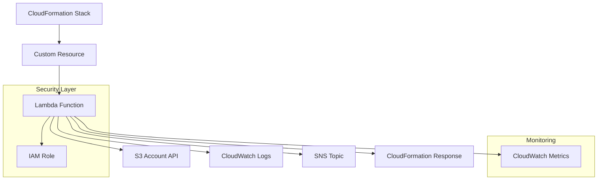

# Design Document

## Overview

Este documento describe el diseño técnico para un CloudFormation Custom Resource que gestiona S3 Block Public Access a nivel de cuenta de AWS. La solución utiliza una función Lambda como backend del custom resource, proporcionando integración nativa con CloudFormation, manejo robusto de errores, y capacidades completas de monitoreo y auditoría.

## Architecture

### High-Level Architecture



### Core Components

#### 1. CloudFormation Custom Resource
- **Type**: `AWS::CloudFormation::CustomResource`
- **ServiceToken**: ARN de la función Lambda
- **Properties**: Configuración de BPA y parámetros operacionales
- **Outputs**: Estado actual de BPA y metadatos de operación

#### 2. Lambda Function
- **Runtime**: Python 3.11 (latest supported)
- **Timeout**: 14 minutes (máximo para custom resources)
- **Memory**: 256 MB (suficiente para operaciones de API)
- **Handler**: Procesa eventos de CloudFormation (CREATE/UPDATE/DELETE)

#### 3. IAM Role y Políticas
- **Principio**: Menor privilegio
- **Permisos S3**: `s3:GetAccountPublicAccessBlock`, `s3:PutAccountPublicAccessBlock`
- **Permisos CloudWatch**: Logs básicos
- **Permisos SNS**: `sns:Publish` (condicional)

## Components and Interfaces

### Lambda Function Interface

#### Input Event Structure
```json
{
  "RequestType": "Create|Update|Delete",
  "ResponseURL": "https://cloudformation-custom-resource-response-...",
  "StackId": "arn:aws:cloudformation:...",
  "RequestId": "unique-id",
  "LogicalResourceId": "S3BlockPublicAccess",
  "ResourceProperties": {
    "BlockPublicAcls": true,
    "IgnorePublicAcls": true,
    "BlockPublicPolicy": true,
    "RestrictPublicBuckets": true,
    "RetainOnDelete": false,
    "NotificationTopicArn": "arn:aws:sns:...",
    "EnableDetailedLogging": true
  }
}
```

#### Response Structure
```json
{
  "Status": "SUCCESS|FAILED",
  "Reason": "Detailed status message",
  "PhysicalResourceId": "account-bpa-{account-id}",
  "StackId": "arn:aws:cloudformation:...",
  "RequestId": "unique-id",
  "LogicalResourceId": "S3BlockPublicAccess",
  "Data": {
    "BlockPublicAcls": true,
    "IgnorePublicAcls": true,
    "BlockPublicPolicy": true,
    "RestrictPublicBuckets": true,
    "LastModified": "2024-01-15T10:30:00Z",
    "OperationId": "op-12345"
  }
}
```

### S3 API Integration

#### GetAccountPublicAccessBlock
- **Purpose**: Obtener configuración actual
- **Error Handling**: Manejo de NoSuchPublicAccessBlockConfiguration

#### PutAccountPublicAccessBlock
- **Purpose**: Aplicar nueva configuración
- **Idempotency**: Comparar estado actual vs deseado
- **Error Handling**: Permisos insuficientes, límites de API

### CloudWatch Integration

#### Metrics
- `CustomResource/BPA/OperationSuccess` (Count)
- `CustomResource/BPA/OperationFailure` (Count)
- `CustomResource/BPA/ExecutionDuration` (Milliseconds)
- `CustomResource/BPA/ConfigurationDrift` (Count)

#### Log Groups
- `/aws/lambda/s3-bpa-custom-resource`
- Structured logging con JSON format
- Log retention: 30 días (configurable)

## Data Models

### BPA Configuration Model
```python
@dataclass
class BPAConfiguration:
    block_public_acls: bool = True
    ignore_public_acls: bool = True
    block_public_policy: bool = True
    restrict_public_buckets: bool = True
    
    def to_aws_format(self) -> dict:
        return {
            'BlockPublicAcls': self.block_public_acls,
            'IgnorePublicAcls': self.ignore_public_acls,
            'BlockPublicPolicy': self.block_public_policy,
            'RestrictPublicBuckets': self.restrict_public_buckets
        }
```

### Operation Context Model
```python
@dataclass
class OperationContext:
    request_type: str
    stack_id: str
    request_id: str
    logical_resource_id: str
    physical_resource_id: str
    account_id: str
    region: str
    timestamp: datetime
    
    def generate_operation_id(self) -> str:
        return f"op-{self.request_id[:8]}-{int(self.timestamp.timestamp())}"
```

## Error Handling

### Error Categories

#### 1. Validation Errors
- Invalid BPA configuration values
- Missing required properties
- Invalid SNS topic ARN format

#### 2. Permission Errors
- Insufficient IAM permissions
- Cross-account access issues
- Service-linked role missing

#### 3. API Errors
- S3 service unavailable
- Rate limiting
- Account-level restrictions

#### 4. Timeout Errors
- Lambda timeout (14 minutes)
- CloudFormation timeout (1 hour)

### Error Response Strategy

```python
def handle_error(error: Exception, context: OperationContext) -> dict:
    error_mapping = {
        'AccessDenied': 'FAILED - Insufficient permissions to modify account BPA settings',
        'InvalidRequest': 'FAILED - Invalid BPA configuration provided',
        'ServiceUnavailable': 'FAILED - S3 service temporarily unavailable',
        'Timeout': 'FAILED - Operation timed out'
    }
    
    return {
        'Status': 'FAILED',
        'Reason': error_mapping.get(type(error).__name__, f'FAILED - {str(error)}'),
        'PhysicalResourceId': context.physical_resource_id
    }
```

## Testing Strategy

### Unit Tests
- BPA configuration validation
- Error handling scenarios
- State comparison logic
- Response formatting

### Integration Tests
- S3 API interactions
- CloudFormation event processing
- SNS notification delivery
- CloudWatch metrics emission

### End-to-End Tests
- Complete CloudFormation stack deployment
- Update scenarios
- Delete scenarios with RetainOnDelete
- Cross-region deployment validation

### Security Tests
- IAM permission validation
- Least privilege verification
- Input sanitization
- Log data sensitivity

## Deployment Architecture

### CloudFormation Template Structure

```yaml
AWSTemplateFormatVersion: '2010-09-09'
Description: 'S3 Block Public Access Custom Resource'

Parameters:
  NotificationEmail:
    Type: String
    Description: Email for BPA operation notifications
  RetainOnDelete:
    Type: String
    Default: 'false'
    AllowedValues: ['true', 'false']

Resources:
  # Lambda Function
  S3BPAFunction:
    Type: AWS::Lambda::Function
    
  # IAM Role
  S3BPARole:
    Type: AWS::IAM::Role
    
  # SNS Topic
  NotificationTopic:
    Type: AWS::SNS::Topic
    
  # Custom Resource
  S3BlockPublicAccess:
    Type: AWS::CloudFormation::CustomResource

Outputs:
  BPAStatus:
    Description: Current Block Public Access configuration
    Value: !GetAtt S3BlockPublicAccess.BlockPublicAcls
```

### Security Considerations

#### IAM Role Design
```json
{
  "Version": "2012-10-17",
  "Statement": [
    {
      "Effect": "Allow",
      "Action": [
        "s3:GetAccountPublicAccessBlock",
        "s3:PutAccountPublicAccessBlock"
      ],
      "Resource": "*"
    },
    {
      "Effect": "Allow",
      "Action": [
        "sns:Publish"
      ],
      "Resource": "${NotificationTopicArn}",
      "Condition": {
        "StringEquals": {
          "aws:RequestedRegion": "${AWS::Region}"
        }
      }
    }
  ]
}
```

#### Lambda Security
- VPC deployment no requerido (S3 es servicio público)
- Environment variables encriptadas con KMS
- Dead letter queue para fallos
- Reserved concurrency para evitar throttling

### Monitoring and Alerting

#### CloudWatch Alarms
- High error rate (>5% en 5 minutos)
- Long execution duration (>2 minutos)
- Failed operations
- Configuration drift detection

#### SNS Notifications
- Operation success/failure
- Configuration changes
- Error conditions
- Compliance status updates

### Operational Procedures

#### Deployment
1. Validar permisos de cuenta
2. Desplegar stack de CloudFormation
3. Verificar configuración BPA
4. Validar notificaciones SNS

#### Updates
1. Comparar configuración actual vs deseada
2. Aplicar cambios incrementales
3. Verificar estado post-actualización
4. Notificar cambios

#### Rollback
1. Identificar configuración previa
2. Revertir cambios BPA si es seguro
3. Notificar rollback
4. Documentar incidente